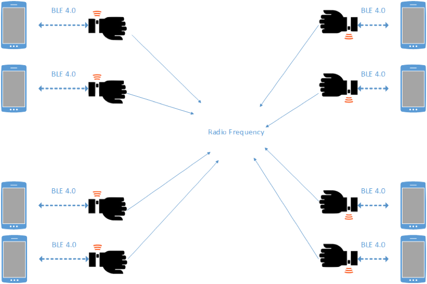

# MeLinkYou  - Project Title 

MeLinkYou is platform for secure transferring HASH-keys across different devices 
via radio-signal to short distance (around 100 - 1000m) and collecting GPS-position of receiver
and sender. No any other information transferring during the session to protect 
personal data and location. 

The main part of the platform is hardware. The core module build around Semtech SX1276 LoRa chip and paired 
with nRF52 SoC. A complete overview over both can be found in the [nRF52 Product Specification](http://infocenter.nordicsemi.com/pdf/nRF52832_PS_v1.3.pdf) 
and in the [SX1276 Data Sheet](https://www.semtech.com/products/wireless-rf/lora-transceivers/sx1276).

Communication process can be displayed in following way:
 

## Working mode
1. Active - transferring data is ON, tracking GPS is ON, BLE is ON
2. Passive - transferring data is ON, tracking GPS is ON, BLE is Off
3. Off - no data transfer, no GPS tracking, no BLE connection.

## Where we are now..
We are in process of completing development board and testing board. 
1. As you can see on picture below we are designed integration board for 
   [CAM-M8 series](https://www.u-blox.com/en/product/cam-m8-series) GPS Module.
2. On the back of the board Li-On battery had been added. I didn't check power consumption 
   for this board, because it was designed as development module and size  and power consumtion 
   are not a priority.
3. Power controller to charge Li-On battery was also added on the board.

## Command

| Command  | Code       | Description                          | Other                |
| :--------|:-----------| :------------------------------------|:---------------------|
| FRUPD    | 0x00000001 | Update radio-frequency               |                      |
| MD       | 0x00000010 | Change working mode                  |                      |
| GPSMD    | 0x00000011 | Turn On/Off GPS tracking             |                      |
| RD       | 0x00000100 | Read data from board                 |                      |
| WR       | 0x00000101 | Write data to board                  |                      |

## Hardware

**MCU**
* CPU: 32-bit ARM Cortex M4 with FPU
* Memory: 64 KB
* Storage: 512 KB Flash

**Wireless features**
* Bluetooth Low Energy, -96 dBm sensitivity
* 2Mbps in BLE mode
* NFC-A type 2
* LoRa, -148 dBm sensitivity

**Features**
* Onboard temperature sensor
* 12-bit 200 ksps ADC with 8 channels, programmable gain
* AES-256 encryption in hardware
* 16 available GPIO pins
* 4 PWM pins
* 3 Real-Time Counters
* GPS: CAM-M8 series (BeiDou, Galileo, GLONASS, GPS / QZSS)

**Operating range**
* -40˙ - 85˙ C
* 1.8V - 3.7V operating range

**Wireless**
* NFC-A ready
* Integrated bluetooth antenna
* Integrated LoRA chip antenna (EU-868 ISM band)
* u.FL connector for 433 MHz ISM band
* Pins for NFC antenna on edge connector

**Web-Site**: http://melinkyou.com

**Mail**: [info@melinkyou.com](mailto:info@melinkyou.com)